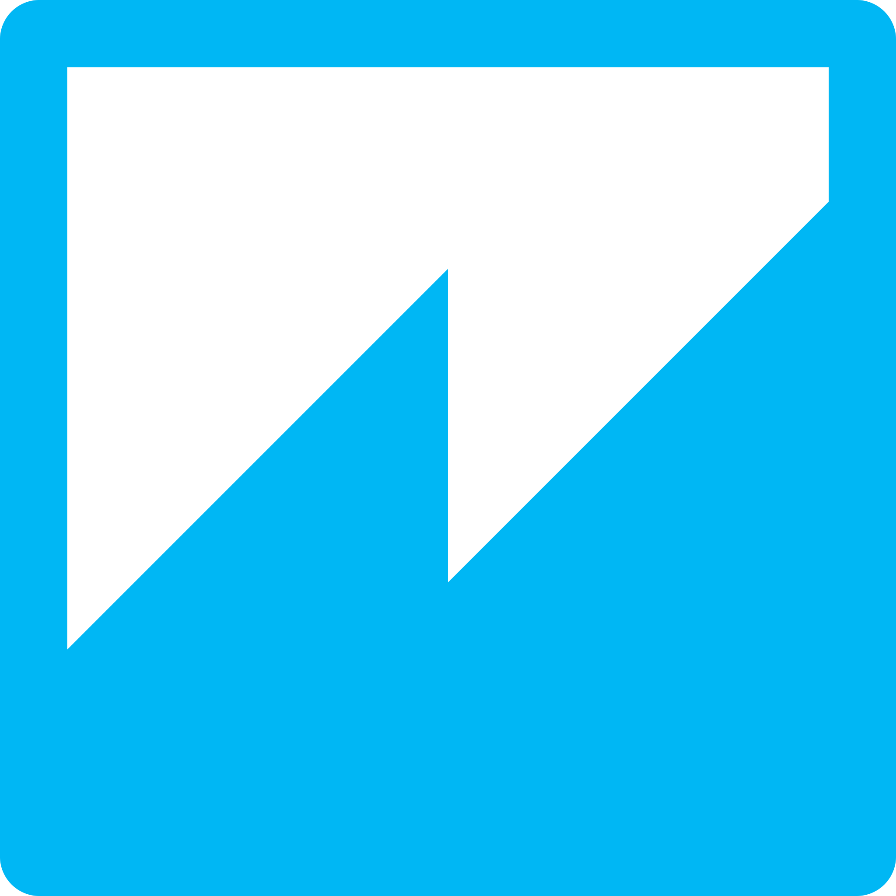

## Hi 👋, I'm a student at Ecole Nationale Polytechnique

### Now
- :mag: Electronics student at Ecole Nationale Polytechnique
- :fire: Interested in web scraping, data science and deep learning
- :calendar: Looking for contributing to python based open source projects and Machine Learning and Deep Learning competitions

### Bio
- 🏢 I'm currently Student at **Ecole Nationale Polytechnique**
- ⚙️ I use daily: `.py`, `.sql`, `.ipynb`, `.json`,  `.md`, `.c` and `.cpp`
- 🌱 Learning all about **Data science** and **Machine Learning**
- 💬 Ping me about **Python**, **Web scraping**, **Machine Learning**, **Deep Learning**, **Computer Vision**, **Signal processing**, **Optics**
- 📫 Reach me: [linkedin.com/Taibaoui-Abdellah/](https://www.linkedin.com/in/abdellah-taibaoui-448039212/)
- :email: Send me an email to abdellah.taibaoui@g.enp.edu.dz
- 📝 Checkout my [Resume](./files/cv.pdf).

### My current stack
   

### Data visualization tools used
  

### Python libraries mastered
         

### Softwares and tools I use daily
     

### Connect with me

    
    
    

